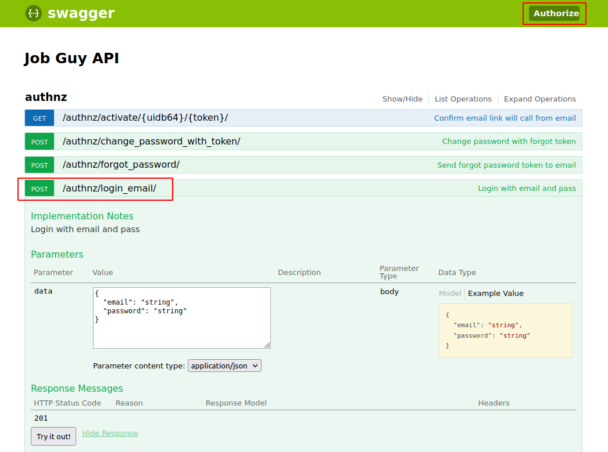
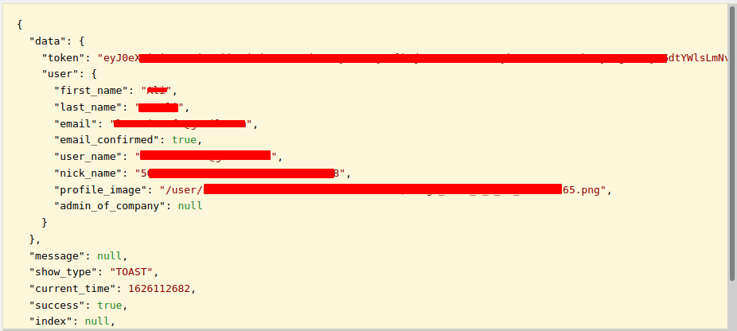
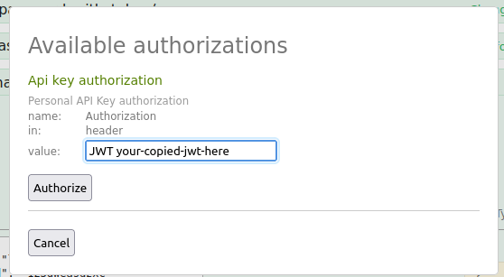
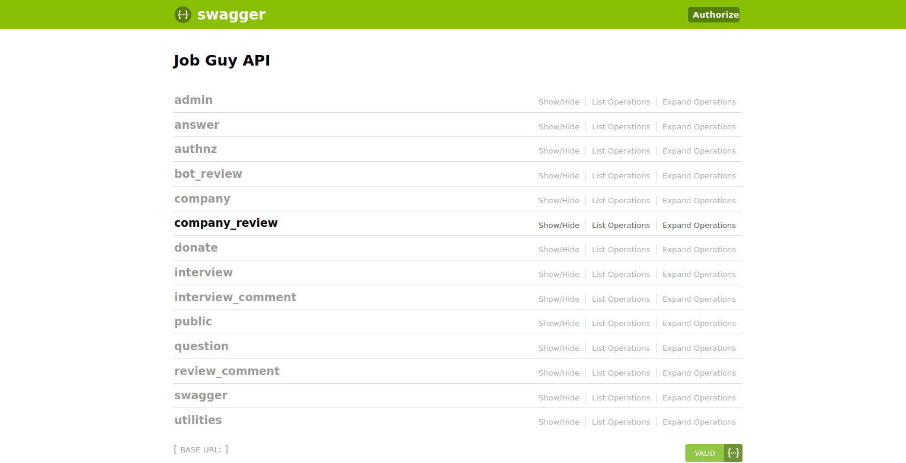

 

## جاب‌گای چیست؟

اونجا وضعیت چطوریه؟  یه سوال به همین کلیت و ابهام

معمولا وقتی برای یه شرکت رزومه می‌فرستیم این سوال کلی و بزرگ برای همه پیش میاد.اونجا وضعیت چطوریه؟!

دونستن تجربه‌های دیگران از کار یا مصاحبه تو شرکتای مختلف می‌تونه به همه کمک کنه به خود سازمان که بازخوردها رو مشاهده کنه به کارجوها که با چشم باز تصمیم بگیرن به نیروهای فعلی که حواسشون رو جمع کنن و ...

وجود سایت‌هایی مثل جاب‌گای باعث میشه اتفاقات ناخوشایند فعلی تو اتاق در بسته مصاحبه کمتر بشه.

همه می‌دونیم تو اتاق مصاحبه ممکنه چه اتفاق‌هایی بیوفته.

از طرف دیگه انتشار تجربه‌ها باعث میشن شرکت‌های حرفه‌ای از غیرحرفه‌ای تمایز پیدا کنن.

فقط یه مساله می‌مونه اونم این که آیا کسایی که تجربه می‌نویسن صادق هستن؟

خب نمیشه به همه اعتماد کرد شاید کسی غرض‌ورزی داشته باشه

شاید رقبا بخوان چهره شرکتو مخدوش کنن. ولی به هر حال هستن کسایی که صادقانه می‌نویسن و شاید این دو گروه یه حد اعتدالی ایجاد کنن.

خوبه که به جای پراکنده‌نویسی و غرغر کردن بیاییم واقع‌گرایانه و شفاف تجربه  مصاحبه یا کاری رو بنویسیم بالاخره یه جایی این چرخه معیوب شکسته میشه

خلاصه:

بازگو کردن تجربه = شفافیت

# Job Guy Backend

# Contribution
Job Guy development depends on your green codes :)

You could also support us financially by visiting https://jobguy.work/donate

For first open source contributers:

1. Pick an issue, or create an issue if there is no issue related to the job you want to do.

2. Mention yourself in that issue so other developers know that there is a developer on that issue.

3. Fork code for your github account

4. Pull it to your local system

5. Create a new branch about your issue

6. After coding and committing the changes, push it to your github account repo.

7. Create a PR with [`develop`](https://github.com/jobguywork/backend/tree/develop) branch, add description about your fix and the related issue if needed.

For openning pull requests you have to send PR's to [`develop`](https://github.com/jobguywork/backend/tree/develop) branch.

## Reset database

    sudo su postgres ->
     psql ->
      DROP DATABASE jobguydb; ->
        CREATE DATABASE jobguydb OWNER jobguy; ->
         run create data api

## OAUTH

    GOOGLE -> https://console.developers.google.com/apis/credentials
    
    
## Data test
    
    Use utilities/create_initial_data API for creation data test in system
 
## Versioning

    Set request header to:
        Accept: application/json; version=<your reuired version>
    
        example:
            Accept: application/json; version=1.0.1

## API Documentaion 
Jobguy uses swagger to generate api docs

you can see docs [here](https://api.jobguy.work/swagger/)

if you head to api link, you'll see this page.

this is the public API 

you can expand this parts and easily try them.

jobguy has more than these public endpoints.

if you want to access those endpoints, you need to authenticate.

to do so, expand the **authnz** part,and you'll see something like this:

### follow these steps for authentication 

1. click on `/authnz/login_email/` endpoint
   

2. click on Example value box on right side, so the required body parameters will appear in data input, and fill it with your own data.
   

3. after you click on **Try it out!**, you'll get a response (like following image)

4. copy the token value, then click on `Authorize` button on top right of the screen, you'll see something like this:

5. fill the *value* input in this format: `JWT YOUR-TOKEN` (as you can see in above image) and then click on Authorize button.

that's it :)

_now you're authorized._

after authorization, you'll see more endpoints like this:

